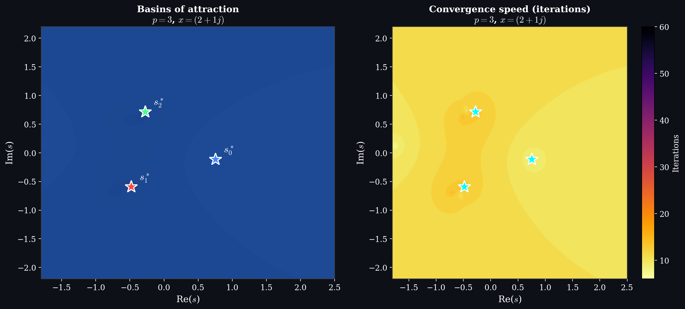
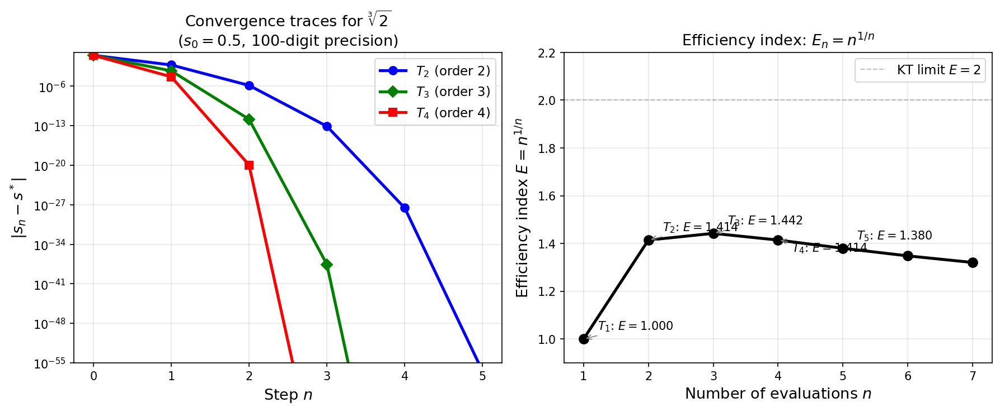
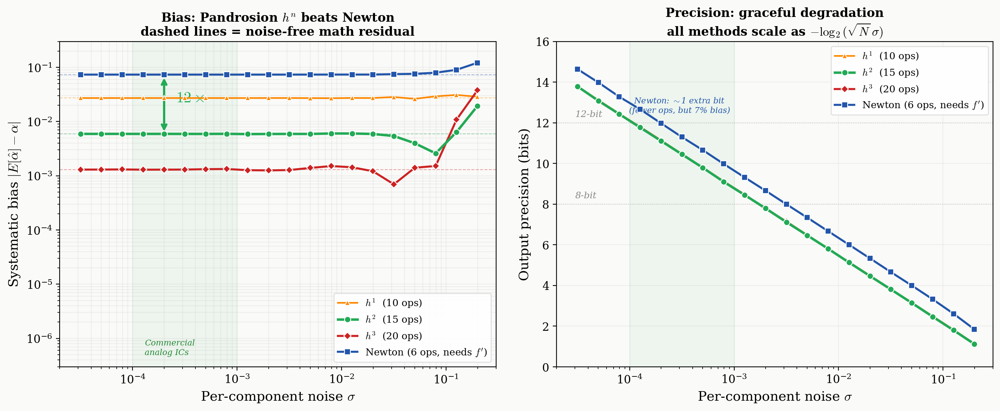

# The Pandrosion Pentalogy

**From ancient geometry to analog hardware computation: A complete mathematical and physical study of derivative-free $p$-th root extraction.**

[](https://creativecommons.org/licenses/by-sa/4.0/)
[](https://doi.org/10.5281/zenodo.19598498)
[](https://hal.science)

## Overview

This repository contains the complete five-part research series exploring **Pandrosion of Alexandria's** geometric construction (c. 340 AD) and its rigorous transformation into an optimal algorithm for analog integrated circuits. The iteration reduces to a single recurrence involving the geometric sum $S_p(s)$:

$$s_{n+1} = 1 - \frac{x-1}{x \cdot S_p(s_n)}$$

The research spans five distinct papers, each tackling a specific facet of this algorithm:

---

### Paper I: Generalized Pandrosion Residuals
**Focus:** Core geometry, contraction ratio $\lambda_{p,x}$, and the geometric scaling optimization.

We prove the convergence signature of the core map $h(s)$ and establish the "Thales preconditioning" $s_0^{\text{opt}} = h(1)$, which exponentially accelerates the fallback convergence without scaling the physical variables.

<p align="center">
  
  <br><em>Pandrosion's pure geometric construction</em>
</p>

---

### Paper II: Complex Dynamics
**Focus:** Basins of attraction and absence of fractal chaos in $\mathbb{C}$.

Unlike Newton's method, which is plagued by chaotic fractal boundaries that can trap noisy signals, Pandrosion's map guarantees smooth, robust basins of attraction over the complex plane, intrinsically protecting against phase-noise trapping.

<p align="center">
  
  <br><em>Smooth, non-fractal basins of attraction</em>
</p>

---

### Paper III: Steffensen-Pandrosion & Optimality
**Focus:** Reaching quadratic convergence without derivatives.

By applying Steffensen's acceleration to the geometric core, we construct a purely derivative-free quadratic method that yields a near-minimal asymptotic error constant $K_S \approx 0.013$ (vastly smaller than Newton's $0.794$).

<p align="center">
  
  <br><em>Steffensen–Pandrosion reaches machine precision in 3 steps</em>
</p>

---

### Paper IV: Higher-Order KT-Optimal Methods
**Focus:** Saturating the Kung-Traub optimal bound.

Extending the principles of Paper III, we establish an entire hierarchy of Kung-Traub optimal extrapolation methods ($T_4, T_8$). They achieve convergence of order $2^{n-1}$ using exactly $n$ evaluations of the core sum $S_p(s)$, heavily outperforming classical high-order techniques.

<p align="center">
  
  <br><em>Order 4 and Order 8 saturation</em>
</p>

---

### Paper V: Analog Hardware Architecture
**Focus:** Physical VLSI realization and systematic bias.

Returning to the constraints of the real world—where mathematical extrapolations like $T_4$ fail due to analog noise amplification—we prove that iterating the pure, primitive map $h(n)$ from Paper I provides the **ultimate analog architecture**. A simple 15-component Pandrosion pipeline ($h^2$) delivers **12× lower systematic bias** than a Newton pipeline, requires no clock, and is unconditionally stable at 10% thermal noise. 

<p align="center">
  
  <br><em>Systematic bias and precision scaling in analog VLSI noise</em>
</p>

---

## Repository Structure

All assets are cleanly organized by type:

```text
├── articles/                        # Compiled PDFs
│   ├── pandrosion_en_improved.pdf   # Paper I: Generalized Pandrosion Residuals
│   ├── pandrosion_complex.pdf       # Paper II: Complex Plane & Basins
│   ├── pandrosion_optimality.pdf    # Paper III: Steffensen-Pandrosion & Optimality
│   ├── pandrosion_higher_order.pdf  # Paper IV: Higher-Order KT-Optimal Methods
│   └── pandrosion_analog.pdf        # Paper V: Analog Hardware Architecture
├── latex/                           # LaTeX source files for all 5 papers
├── figures/                         # High-res output figures (.png and .pdf)
├── verification_*.py                # 309+ numerical Monte Carlo/Assertions
└── figures_*.py                     # Python scripts generating all plots
```

## Building

### Compile the PDFs
```bash
# We recommend using tectonic
cd latex
tectonic pandrosion_analog.tex
```

### Generate Figures
```bash
pip install numpy matplotlib
python3 figures_analog.py
```

### Run Verification Suites
The repository contains Python scripts mathematically verifying every claim across the 5 papers:
```bash
python3 verification_article_complet.py   # Paper I tests
python3 verification_complex.py           # Paper II tests
python3 verification_optimality.py        # Paper III tests
python3 verification_higher_order.py      # Paper IV tests
python3 verification_analog.py            # Paper V Monte Carlo tests
```

## Citation

```bibtex
@article{besevic2026pandrosion_suite,
  title     = {The Pandrosion Pentalogy: From geometry to analog hardware computation},
  author    = {Besevic, Ivan},
  year      = {2026},
  note      = {Preprint series, HAL},
  doi       = {10.5281/zenodo.19598498}
}
```

## License

This work is licensed under [CC BY-SA 4.0](https://creativecommons.org/licenses/by-sa/4.0/).

## Author

**Ivan Besevic** — April 2026
