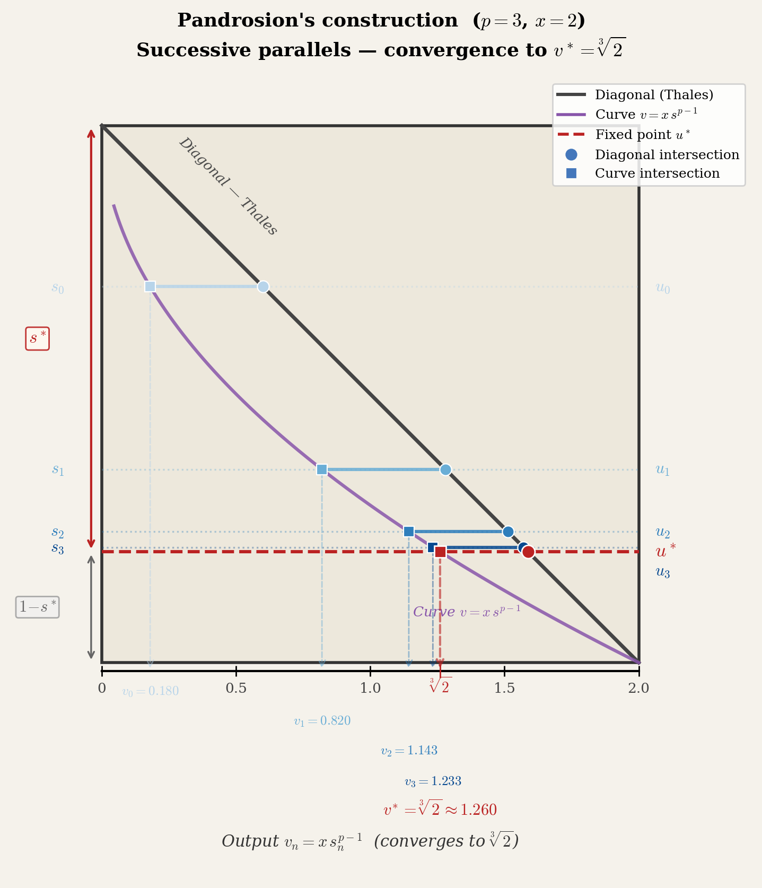
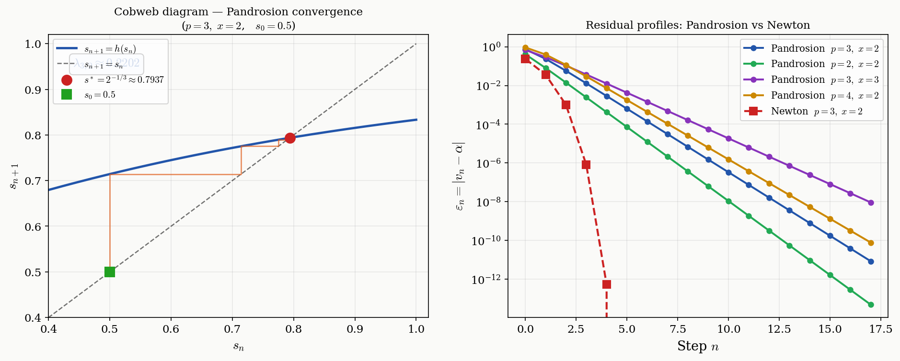
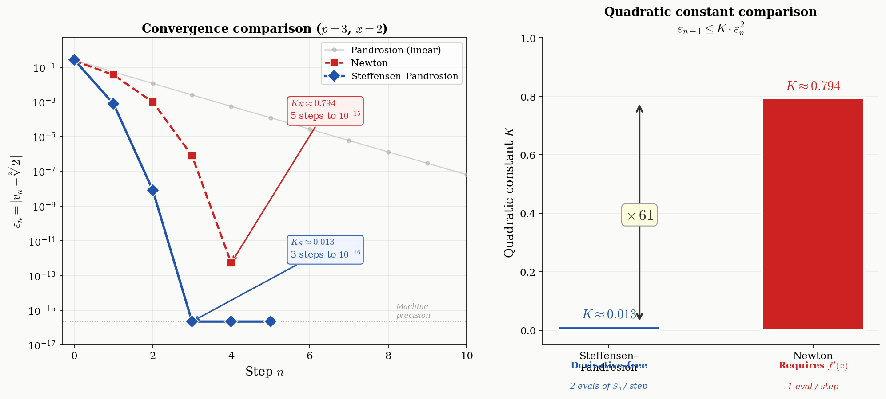

# Generalized Pandrosion Residuals

**Residual profile of an iterative geometric construction for *p*-th roots of any positive real number.**

[](https://creativecommons.org/licenses/by-sa/4.0/)
[](https://hal.science)

## Overview

We revisit **Pandrosion of Alexandria's** classical geometric construction for approximating cube roots — reported by Pappus in the *Collectio* (c. 340 AD) — and generalize it to the computation of *p*-th roots of any positive real *x*.

The iteration reduces to a single recurrence involving the geometric sum $S_p(s) = 1 + s + \cdots + s^{p-1}$:

$$s_{n+1} = 1 - \frac{x-1}{x \cdot S_p(s_n)}, \qquad v_n = x \cdot s_n^{p-1} \;\to\; x^{1/p}$$

We derive the **exact contraction ratio** (convergence signature):

$$\lambda_{p,x} = \frac{(\alpha - 1)\sum_{k=1}^{p-1} k\,\alpha^{p-1-k}}{\sum_{k=0}^{p-1} \alpha^k}, \qquad \alpha = x^{1/p}$$

### Key Results

| Result | Reference |
|--------|-----------|
| Closed-form contraction ratio λ_{p,x} | Theorem 4.1 |
| Double monotonicity (in *p* and *x*) | Theorem 8.1 |
| Non-asymptotic error bounds | Theorem 9.1 |
| Extension to *x* < 1 (oscillatory) | Proposition 10.1 |
| Optimal starting point | Proposition 11.1 |
| **Steffensen–Pandrosion** (quadratic, derivative-free) | Theorem 12.1 |
| **Scaling optimization** (39× reduction for large *x*) | Proposition 13.1 |

### Steffensen–Pandrosion vs Newton

The paper's central applied result: Steffensen's acceleration transforms Pandrosion's ancient geometric construction into a **quadratically convergent, derivative-free** method with constant $K_S \approx 0.013$, vastly outperforming Newton's $K_N \approx 0.794$ for the same problem.

| Method | Order | Constant *K* | Steps to 10⁻¹⁶ | Derivative? |
|--------|:-----:|:------------:|:---------------:|:-----------:|
| Pandrosion | 1 | λ ≈ 0.220 | ~16 | No |
| Newton | 2 | K ≈ 0.794 | 5 | **Yes** |
| **Steffensen–Pandrosion** | **2** | **K ≈ 0.013** | **3** | **No** |

## Figures

<p align="center">
  
  <br><em>Pandrosion's geometric construction for p=3, x=2</em>
</p>

<p align="center">
  
  <br><em>Cobweb diagram and residual profiles: Pandrosion vs Newton</em>
</p>

<p align="center">
  
  <br><em>Steffensen–Pandrosion reaches machine precision in 3 steps (K_S/K_N ≈ 1/61)</em>
</p>

## Repository Structure

```
├── pandrosion_en_improved.tex    # Main article (English, latest version)
├── pandrosion.tex                # Article (French)
├── pandrosion_en.tex             # Article (English, earlier version)
├── figures.py                    # Figure generation (matplotlib)
├── verification_article_complet.py  # 143 tests — core article (§1–§7)
├── verification_new_sections.py     # 166 tests — new sections (§8–§13)
├── pandrosion_geometry.{pdf,png}    # Figure 1: geometric construction
├── pandrosion_figures.{pdf,png}     # Figure 2: cobweb + residual profiles
├── pandrosion_steffensen.{pdf,png}  # Figure 3: Steffensen vs Newton
└── pandrosion_en_improved.pdf       # Compiled PDF
```

## Building

### Compile the PDF

```bash
# Using tectonic (recommended)
tectonic pandrosion_en_improved.tex

# Or using pdflatex
pdflatex pandrosion_en_improved.tex && pdflatex pandrosion_en_improved.tex
```

### Generate Figures

```bash
pip install numpy matplotlib
python3 figures.py
```

### Run Verification Suite (309 tests)

```bash
python3 verification_article_complet.py   # 143 tests — §1–§7
python3 verification_new_sections.py      # 166 tests — §8–§13
```

All 309 numerical assertions verify every formula, table value, and convergence claim in the paper against independent Python computation.

## Mathematical Highlights

### The contraction ratio is a "convergence signature"

For any target α = x^{1/p}, the ratio λ_{p,x} is entirely determined by α — the target itself dictates how fast Pandrosion's method approaches it. Different methods (Pandrosion, bisection, Newton) produce different residual profiles for the same number, illustrating the paper's thesis:

> *"The residual profile is a property of the method, not of the number."*

### Scaling optimization

For large *x*, direct Pandrosion is impractical (λ → 1). By writing x^{1/p} = ⌊x^{1/p}⌋ · (x/A)^{1/p} with A = ⌊x^{1/p}⌋^p, we reduce to x' ≈ 1 where λ ≈ 0:

| x | λ (direct) | λ (scaled) | Reduction | Iterations |
|---:|:---:|:---:|:---:|:---:|
| 10 | 0.615 | 0.073 | 8× | 49 → 8 |
| 100 | 0.890 | 0.145 | 6× | 213 → 11 |
| 1,000 | 0.973 | 0.103 | 9× | >500 → 9 |
| 10,000 | 0.994 | 0.025 | **39×** | >500 → 5 |

Combined with Steffensen: **2–3 steps** for any x, any p.

## Citation

```bibtex
@article{besevic2026pandrosion,
  title     = {Generalized Pandrosion Residuals: Residual Profile of an
               Iterative Geometric Construction for $p$-th Roots},
  author    = {Besevic, Ivan},
  year      = {2026},
  note      = {Preprint, HAL}
}
```

## License

This work is licensed under [CC BY-SA 4.0](https://creativecommons.org/licenses/by-sa/4.0/) (Creative Commons Attribution-ShareAlike 4.0 International).

## Author

**Ivan Besevic** — April 2026
